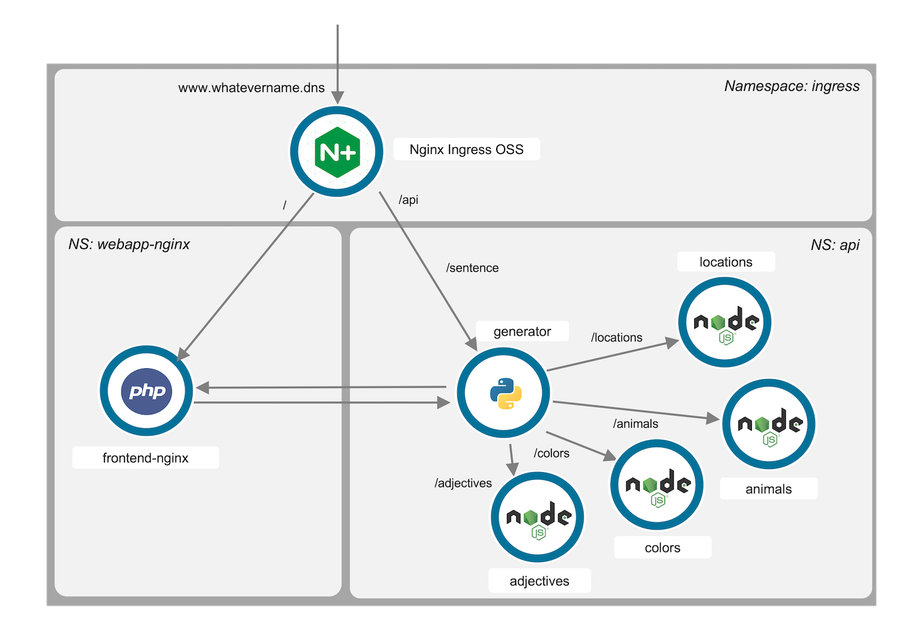

# Description
This is a very simple kubernetes demo application intended to show most of the benefits of using F5 Technology for your application delivery and security.
It is composed of multiple technology frameworks.

This app will generate a sentence :)

  


# App Documentation

Every `WORD` pod delivers a list of `WORDS`. Then, the `GENERATOR` select one `WORD` per POD, and generates a `SENTENCE` in a JSON format

  


``` json
{
    "adjectives": "proud",
    "animals": "lion",
    "colors": "blue",
    "locations": "park"
}
```

Then, the frontend web application will `display` all the `words` in a `sentence`. If one micro-service is not deployed, the word is not displayed.

In term of micro-services, this is how there are used by the Webapp frontend.

  

# App Installation

## Install Nginx OSS Ingress Controller

In your k8S, install an Nginx OSS Ingress Controller (helm is the way to do it - install helm first)

```
kubectl create ns ingress

helm repo add nginx-stable https://helm.nginx.com/stable
helm repo update

helm install nginx-ingress nginx-stable/nginx-ingress --namespace ingress --set controller.service.type=NodePort
```

## Deploy all the pods manifests (in directoy /k8s-manifests)

`WORDS` pods are deployed in `api` namespace 

`FRONTEND` pod is deployed in `webapp-nginx` namespace


```
kubectl create ns api
kubectl create ns webapp-nginx

kubectl apply -f sentence-api-all.yaml -n api
kubectl apply -f sentence-nginx-webapp.yaml -n webapp-nginx
```

## Deploy the Ingress Virtual Server resource

Now, we must route the traffic either to the `Nginx WebApp Frontend` pod, if path is /, or route to `WORDS` pods is path starts with `/api`

To do so, we will Ingress Virtual Server Route resource (better than an Ingress resource)

```
kubectl apply -f ingress-vs-master.yaml
kubectl apply -f ingress-vs-route-api.yaml -n api
kubectl apply -f ingress-vs-route-frontend.yaml -n api
```

## Test the app

First, find the NodePort used by the ingress.

```
kubectl get service -n ingress

NAME                          TYPE       CLUSTER-IP     EXTERNAL-IP   PORT(S)                      AGE
nginx-ingress-nginx-ingress   NodePort   10.43.129.50   <none>        80:32061/TCP,443:32553/TCP   77m
```

Collect the port used for port `80`. Here, it is the port `32061`

Test your app :)

```
curl -H "Host: api.sentence.com" http://127.0.0.1:32061/api/colors
curl -H "Host: api.sentence.com" http://127.0.0.1:32061/api/locations
curl -H "Host: api.sentence.com" http://127.0.0.1:32061/api/sentence
```

You can also test your app in a browser http://api.sentence.com:32061/

# Courtesy of:
Thanks to https://www.npmjs.com/package/json-server for the zero coding JSON Server.
